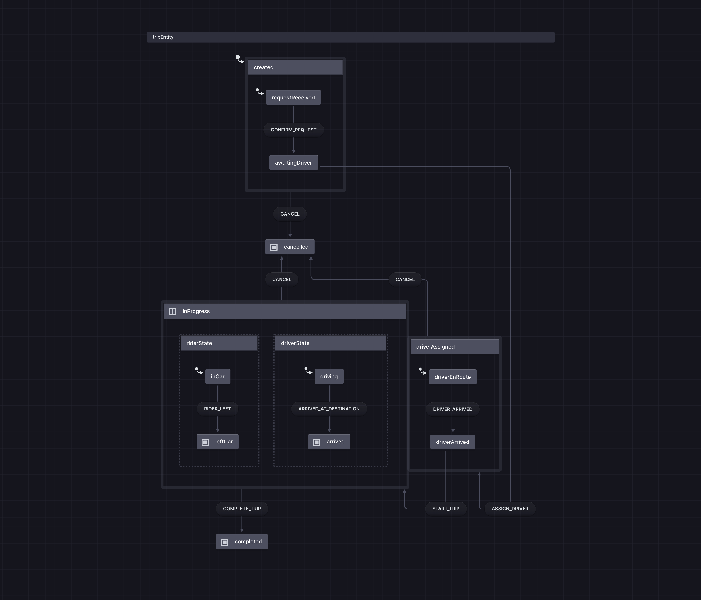

# self-practice-akka-fsm
A self-practice project for Akka.NET FSM actor.

## Introduction
This project implements the `TripEntity` state, as shown in the following statechart:


The state representation is done using [Akka.NET FSM Actor](https://getakka.net/articles/actors/finite-state-machine.html). In this project, some Statechart concepts are implemented:

- **Nested States**: **Created** is a state of Trip, and **Created** has its own inner state.
- **Concurrent States**: **InProgress** has two concurrent inner states, **DriverState** and **RiderState**. Once both inner states are completed, **InProgress** is considered completed.
- **Cancel**: If `TripEntity` receives a **Cancel** event, the state will transition to **Canceled** regardless of the current state of `TripEntity` and its inner state.


Statechart supports communication between different state machine. It could be implemented with Akka.NET FSM Actor easily since actor support message interaction by default.

## Build
```bash
dotnet build
```

## Test
```bash
dotnet test
```
