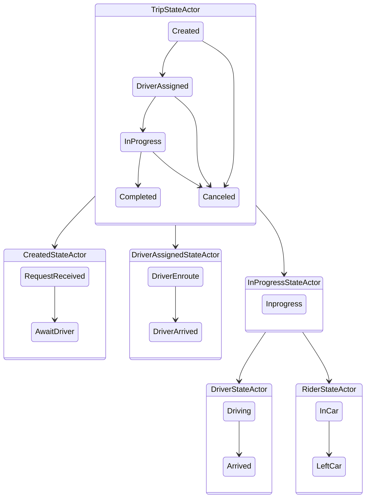

```mermaid
stateDiagram
    

    state TripStateActor {
        Created --> DriverAssigned
        DriverAssigned --> InProgress
        InProgress --> Completed
        InProgress --> Canceled
        DriverAssigned --> Canceled
        Created --> Canceled        
    }
    TripStateActor --> CreatedStateActor
    TripStateActor --> DriverAssignedStateActor
    TripStateActor --> InProgressStateActor

    state CreatedStateActor {
        RequestReceived --> AwaitDriver
    }

    state DriverAssignedStateActor {
        DriverEnroute --> DriverArrived
    }

    state InProgressStateActor {
        Inprogress
    }

    InProgressStateActor --> DriverStateActor
    InProgressStateActor --> RiderStateActor

    state DriverStateActor {
        Driving --> Arrived
    }    

    state RiderStateActor {
        InCar --> LeftCar
    }    

    
    classDef actor fill:#f9f,stroke:#333,stroke-width:2px,rx:10,ry:10;
    class TripStateActor, CreatedStateActor,DriverAssignedStateActor,InProgressStateActor,DriverStateActor,RiderStateActor actor;

```